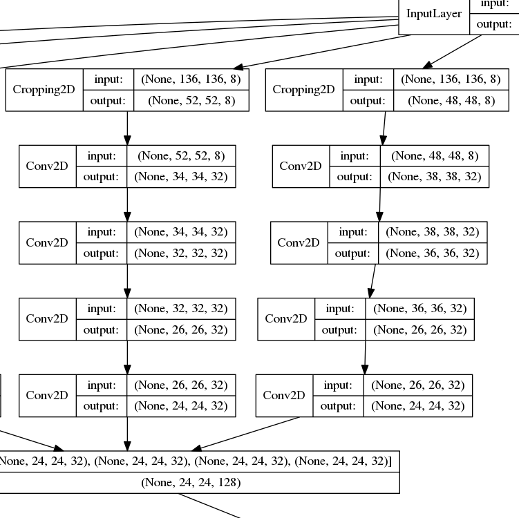

### Code related to kaggle competition [dstl satallite imagery feature detection](https://www.kaggle.com/c/dstl-satellite-imagery-feature-detection)

This repository includes image processing code and networks based on dilated convolution I used for the dstl competition. The included
tiny network has a intersection over union score of 0.391 on public leaderboard and 0.358 on private leaderboard. It is trained only on the M images, which were all rescaled to 835x835 to facilitate comparison with higher resolution versions of the net. Code provided on the forums for making binary masks and converting binary mask to polygon was used, with the modification that binary masks were upscaled 4x on width and height before converting to polygon. 

### Notes on running
 To run change `DATA_DIR` in global\_vars.py to your top level directory. This directory should have the folders `sixteen_band` and `three_band` along with train\_wkt\_v4.csv, grid\_sizes.csv and sample\_submission.csv. It should have sub-directories, `labels`, `weights`, `bin_masks`, and `submissions` made before trying to run the notebooks. 

 * utils.py has various functions required to run the rest the rest of the code
 * dilated\_nets.py has the neural network definitions

### Network archetecture

Network archetecture is an inverted pyrmid. Padding is not used, so images decrease with size as moving through the network. Output size is fixed and each path uses different parts of the image. Dilated convolution is used early in the network to decrease the size of the images but to retain larger receptive field for the output neurons. Different paths are combined later in the network. Dropout is used at final layers for added regularization as no max pooling is used. All Conv2D layers are actually `conv->batchnorm->relu` but the extra layers are suppressed to make viewing slightly easier.

Below is a look at a smaller section of some of the earlier layers. The pattern used in for the network in this repository is
`dilated_conv3x3 -> conv3x3 -> dilated_conv 3x3 > conv3x3`, 

Trying other ideas currently but moving to another dataset because of difficulty validating on the dstl data. 

